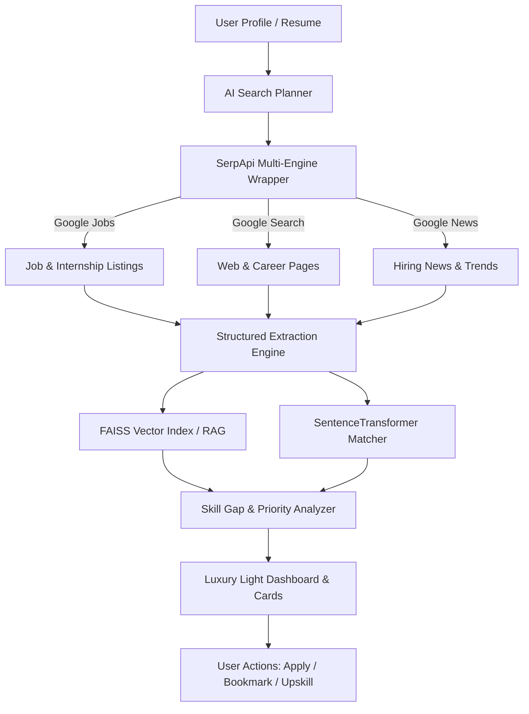

# OpportunityIQ — Hackathon Pitch Deck

**SerpApi India Hackathon 2026 | Track: AI Agents**

---

## Slide 1: Title

```
┌─────────────────────────────────────────────────────────────────────────────┐
│                                                                             │
│                               OPPORTUNITY IQ                                │
│                     Discover. Verify. Analyze. Act.                         │
│                                                                             │
│            An AI-Powered Live Opportunity Intelligence Platform             │
│                                                                             │
│  Team: OpportunityIQ Developers                                             │
│  Hackathon: SerpApi India Hackathon 2026                                    │
│  Theme: Luxury Modern Light System (#F8FAFC | #0F172A | #2563EB)            │
│                                                                             │
└─────────────────────────────────────────────────────────────────────────────┘
```

> **Tagline**: Turning chaotic job search data into structured, actionable career intelligence.

---

## Slide 2: The Problem

### *The Career Search Dilemma for Students & Early Professionals*

* ❌ **Scattered Information Firehose**: Internships, entry-level jobs, and hackathons are fragmented across dozens of static job boards and change daily.
* ❌ **Hours Wasted Manual Research**: Candidates spend 15+ hours a week copying job specs, manually matching eligibility, and verifying deadlines.
* ❌ **The "Blind Application" Syndrome**: Job seekers apply without knowing if their profile matches the requirements or what skills they lack.
* ❌ **Unidentifiable Skill Gaps**: No easy way to know *which* missing technical skills are critical vs. nice-to-have, or what to learn next.

> [!WARNING]
> Existing job portals show static listings without profile context or transparent skill-gap analysis.

---

## Slide 3: Our Solution — OpportunityIQ

### *An Intelligent Career Research Assistant Powered by SerpApi & AI Agents*

OpportunityIQ transforms unstructured web search results into personalized, explainable career guidance.

1. 🔍 **Live Real-Time Web Search**: Powered directly by SerpApi (Google Jobs, Google Search, Google News).
2. 📄 **Deep Resume Understanding**: Automated PDF/DOCX parsing extracts skills, experience level, and target roles.
3. 🎯 **Semantic Profile Matching**: Cosine similarity matching between candidate profiles and job requirements.
4. 📊 **Actionable Skill Gap Breakdown**: Clear analysis highlighting matched skills, missing skills, and prioritized learning pathways.
5. 🛡️ **Source-Verified Citing**: Every job link and claim links directly back to its live source — 0% hallucinated listings.

---

## Slide 4: How OpportunityIQ Works

### *End-to-End System Data Flow*



---

## Slide 5: Autonomous AI Agent Architecture

### *LangGraph Multi-Step Reasoning Workflow*

OpportunityIQ uses an autonomous **LangGraph** stateful agent architecture (`AgentWorkflow`):

1. 🧠 **Planning Stage**: `SearchPlanner` analyzes user profile and intent, generating optimal multi-engine query parameter payloads.
2. 🌐 **Retrieval Stage**: `SerpApiWrapper` executes real-time API calls across Google Jobs, Google Search, and Google News.
3. ⚙️ **Extraction & Structuring**: Standardizes disparate JSON schemas into normalized `Opportunity` Pydantic models.
4. ⚡ **RAG Vector Storage**: `RAGPipeline` generates 384-dim embeddings (`all-MiniLM-L6-v2`) and indexes opportunities into a local FAISS store.
5. 📊 **Scoring & Skill Gap Analysis**: Computes transparent weighted scores:
   * **Skills Match**: 50%
   * **Experience Fit**: 20%
   * **Education Alignment**: 10%
   * **Location Preference**: 10%
   * **Role Preferences**: 10%

---

## Slide 6: SerpApi Integration — The Core Engine

### *Why SerpApi is Fundamental to OpportunityIQ*

SerpApi is **not an add-on** — it is the core data provider powering live intelligence. Static job databases become stale within hours.

```
┌─────────────────────────────────────────────────────────────────────────────┐
│                            SERPAPI MULTI-ENGINE LAYER                       │
├──────────────────────┬──────────────────────┬───────────────────────────────┤
│    GOOGLE JOBS API   │   GOOGLE SEARCH API  │        GOOGLE NEWS API        │
├──────────────────────┼──────────────────────┼───────────────────────────────┤
│ • Position Titles    │ • Company Career     │ • Hiring Announcements        │
│ • Company Names      │   Pages              │ • Industry Expansion Trends   │
│ • Salary & Stipends  │ • Application Links  │ • Tech Stack Announcements    │
│ • Direct Apply Urls  │ • Hackathon Pages    │ • Campus Drive Dates          │
└──────────────────────┴──────────────────────┴───────────────────────────────┘
```

> **Value Proposition**: 100% real-time accuracy, zero web-scraping breakage, and immediate source provenance for every opportunity displayed.

---

## Slide 7: Resume + RAG Intelligence

### *Context-Aware Matching with Vector Search*

* 📄 **Multi-Format Document Ingestion**: Supports PyPDF2 (PDF), python-docx (DOCX), and raw text parsing.
* 🧩 **Automated Skill Extraction**: Regex-backed entity extraction categorizes candidate skills (Languages, Frameworks, Cloud, Databases).
* ⚡ **Vector RAG Store**:
  * Job descriptions indexed using `sentence-transformers` (`all-MiniLM-L6-v2`).
  * Enables semantic similarity retrieval beyond literal keyword matches (e.g., matching "React" with "Frontend Engineering").

---

## Slide 8: Personalized Analysis Example

### *Transparent Match & Skill Gap Breakdown*

```
┌─────────────────────────────────────────────────────────────────────────────┐
│ OPPORTUNITY: Senior Python Developer — QuantumTech Inc.                     │
│ MATCH SCORE: 82% (High Fit)                                                 │
├─────────────────────────────────────────────────────────────────────────────┤
│                                                                             │
│  [✓] MATCHED SKILLS (5/7)         [!] SKILL GAPS (2/7 - Actionable)         │
│  • Python (Advanced)              • FastAPI (High Priority)                 │
│  • Machine Learning               • Docker / Kubernetes                     │
│  • SQL Databases                                                            │
│  • Git & CI/CD                                                              │
│  • REST APIs                                                                │
│                                                                             │
│  💡 AI RECOMMENDATION:                                                      │
│  "You are a strong candidate for this role. Building 1 project using         │
│   FastAPI & Docker will boost your fit score to 95%."                       │
└─────────────────────────────────────────────────────────────────────────────┘
```

---

## Slide 9: Product Tour & Interface Highlights

### *Luxury Modern Light Interface System*

* 🎨 **Design System**: Built with a Porcelain Slate canvas (`#F8FAFC`), Deep Slate navigation sidebar (`#0F172A`), and Royal Indigo accent controls (`#2563EB`).
* 📊 **Executive Dashboard**: Key metrics (Total Opportunities, Saved Bookmarks, Average Skill Fit) and instant search triggers.
* 📌 **Deterministic Saved Opportunities**: Single-click persistent bookmarking with MD5 hash integrity (`opp_md5hash`).
* 📤 **High-Contrast Profile Hub**: Drag-and-drop resume parser with live preview and skill customization.

---

## Slide 10: Impact & Future Roadmap

### *Transforming Job Search into Strategic Career Intelligence*

### Impact & Deliverables
* ⏱️ **90% Time Savings**: Reduces research time from hours to seconds.
* 🎯 **Higher Application Conversion**: Empowers candidates to focus on high-fit roles.
* 🚀 **Personalized Upskilling**: Directs learning efforts strictly toward high-value skill gaps.

### Future Roadmap
1. 🔔 **Automated Opportunity Monitoring**: Real-time alerts via email/WhatsApp when high-fit jobs appear on SerpApi.
2. 🤝 **Application Tracker Integration**: Sync saved opportunities directly with Notion/Kanban boards.
3. 🌐 **Multi-Language & Global Expansion**: Localized search filtering across international job markets.

---

```
┌─────────────────────────────────────────────────────────────────────────────┐
│                                                                             │
│                         THANK YOU / Q&A SESSION                             │
│                                                                             │
│                     OpportunityIQ — Powered by SerpApi                      │
│            GitHub: https://github.com/24cs73-prince/Serpapi-ai-opportunity-agent-hackathon │
│                                                                             │
└─────────────────────────────────────────────────────────────────────────────┘
```
